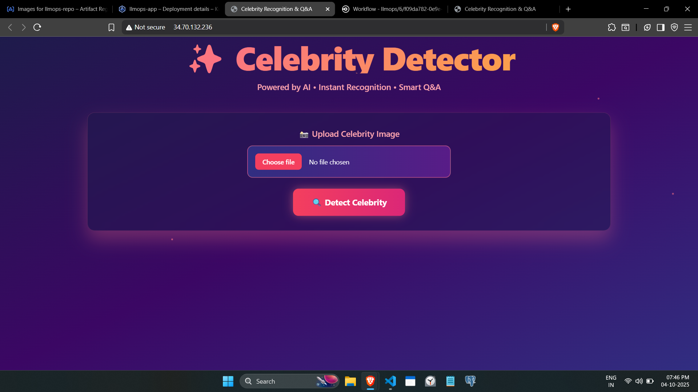

# Celebrity Detector & Q&A with CI/CD Pipeline

A Flask-based web application that detects celebrities from uploaded images using face detection and provides an AI-powered Q&A system to answer questions about the identified celebrity. The project implements a complete CI/CD pipeline using CircleCI and deploys to Google Kubernetes Engine (GKE).

## Features

- **Face Detection**: Uses OpenCV's Haar Cascade Classifier to detect and highlight faces in uploaded images
- **Celebrity Recognition**: Leverages Groq's Llama 4 Maverick model for celebrity identification
- **AI-Powered Q&A**: Ask questions about the detected celebrity and get intelligent responses
- **Modern UI**: Interactive web interface with animations and gradient effects
- **CI/CD Pipeline**: Automated build, test, and deployment using CircleCI
- **Container Orchestration**: Deployed on Google Kubernetes Engine with LoadBalancer service

## Demo Video-
[](https://youtu.be/AQkuhMPbYZ8)

## Technology Stack

### Backend
- **Flask**: Web framework
- **OpenCV**: Face detection using Haar Cascade
- **NumPy**: Image processing

### AI/ML
- **Groq API**: Celebrity recognition and Q&A using Llama 4 Maverick 17B model
- **Vision AI**: Image-based celebrity identification

### DevOps
- **Docker**: Containerization
- **CircleCI**: CI/CD automation
- **Google Kubernetes Engine (GKE)**: Container orchestration
- **Google Artifact Registry**: Docker image storage

### Frontend
- **Tailwind CSS**: Styling
- **Custom CSS**: Animations and effects


## Application Demo-



### Information regarding Image 👇


### ChatBot 👇 


## Project Structure

```
Face_Detector_Q&A_CircleCI_Kuernetes/
├── .circleci/
│   └── config.yml              # CircleCI pipeline configuration
├── app/
│   ├── __init__.py             # Flask app factory
│   ├── routes.py               # Application routes
│   └── utils/
│       ├── celebrity_detector.py   # Celebrity identification logic
│       ├── image_handler.py        # Image processing and face detection
│       └── qa_engine.py            # Q&A functionality
├── static/
│   └── style.css               # Custom animations and styles
├── templates/
│   └── index.html              # Frontend UI
├── Dockerfile                  # Docker configuration
├── kubernetes-deployment.yaml  # Kubernetes deployment manifest
├── requirements.txt            # Python dependencies
├── setup.py                    # Package setup
└── app.py                      # Application entry point
```

## How It Works

### 1. Face Detection
- User uploads an image
- OpenCV converts the image to grayscale
- Haar Cascade Classifier detects faces
- The largest face is selected and highlighted with a bounding box

### 2. Celebrity Recognition
- Detected face image is encoded to base64
- Sent to Groq API with Llama 4 Maverick model
- AI identifies the celebrity and provides:
  - Full Name
  - Profession
  - Nationality
  - Famous For
  - Top Achievements

### 3. Q&A System
- User asks questions about the detected celebrity
- Query is sent to Groq API with context about the celebrity
- AI generates accurate, concise responses

## CI/CD Pipeline

The CircleCI pipeline consists of three main jobs:

### 1. Checkout Code
- Clones the repository

### 2. Build Docker Image
- Authenticates with Google Cloud
- Builds Docker image from Dockerfile
- Pushes image to Google Artifact Registry

### 3. Deploy to GKE
- Authenticates with Google Cloud
- Configures kubectl for GKE cluster
- Applies Kubernetes deployment manifest
- Performs rolling restart of the deployment

### Workflow
```
checkout_code → build_docker_image → deploy_to_gke
```


## Kubernetes Deployment

### Deployment Configuration
- **Replicas**: 1 pod
- **Container Port**: 5000
- **Environment Variables**: GROQ_API_KEY (from Kubernetes secrets)
- **Image**: Pulled from Google Artifact Registry

### Service Configuration
- **Type**: LoadBalancer
- **External Port**: 80
- **Target Port**: 5000 (Flask app)

## Setup Instructions

### Prerequisites
- Python 3.10
- Docker
- Google Cloud account with GKE enabled
- CircleCI account
- Groq API key

### Local Development

1. **Clone the repository**
```bash
git clone <repository-url>
cd Face_Detector_Q&A_CircleCI_Kuernetes
```

2. **Create virtual environment**
```bash
python -m venv venv
source venv/bin/activate  # On Windows: venv\Scripts\activate
```

3. **Install dependencies**
```bash
pip install -e .
```

4. **Set environment variables**
Create a `.env` file:
```
GROQ_API_KEY=your_groq_api_key
SECRET_KEY=your_secret_key
```

5. **Run the application**
```bash
python app.py
```

Visit `http://localhost:5000` in your browser.

### Docker Deployment

1. **Build Docker image**
```bash
docker build -t celebrity-detector .
```

2. **Run container**
```bash
docker run -p 5000:5000 -e GROQ_API_KEY=your_key celebrity-detector
```

### CircleCI Setup

1. **Add environment variables** in CircleCI project settings:
   - `GCLOUD_SERVICE_KEY`: Base64-encoded GCP service account key
   - `GKE_CLUSTER`: Your GKE cluster name
   - `GOOGLE_COMPUTE_REGION`: GCP region (e.g., us-central1)
   - `GOOGLE_PROJECT_ID`: Your GCP project ID

2. **Create Kubernetes secret** for Groq API key:
```bash
kubectl create secret generic llmops-secrets \
  --from-literal=GROQ_API_KEY=your_groq_api_key
```

3. **Push to master branch** to trigger the pipeline

## Dependencies

```
Flask
opencv-python
python-dotenv
numpy
requests
```

## API Usage

### Groq API Integration

**Model**: `meta-llama/llama-4-maverick-17b-128e-instruct`

**Celebrity Detection**:
- Temperature: 0.3
- Max Tokens: 1024

**Q&A Engine**:
- Temperature: 0.5
- Max Tokens: 512

## Environment Variables

| Variable | Description |
|----------|-------------|
| `GROQ_API_KEY` | API key for Groq services |
| `SECRET_KEY` | Flask secret key for session management |
| `GCLOUD_SERVICE_KEY` | GCP service account credentials (CircleCI) |
| `GKE_CLUSTER` | GKE cluster name (CircleCI) |
| `GOOGLE_COMPUTE_REGION` | GCP region (CircleCI) |
| `GOOGLE_PROJECT_ID` | GCP project ID (CircleCI) |

## Author

**Om Bhandwalkar**

## License

This project is open source and available for educational purposes.