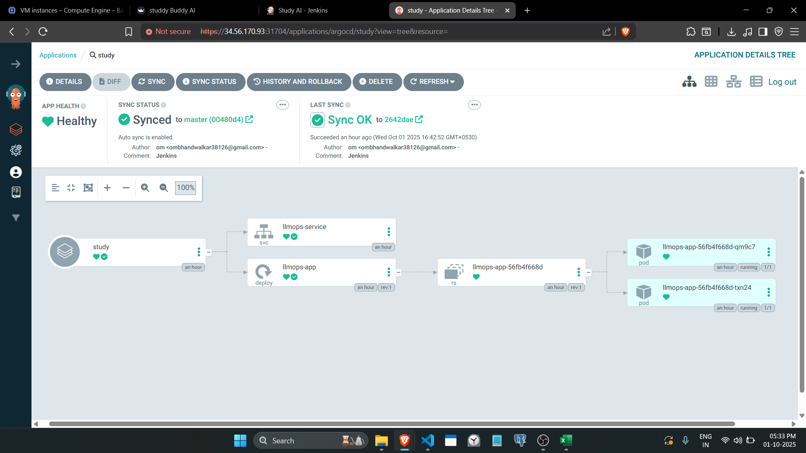

# 🚀 Study AI - LLMOps with Jenkins, ArgoCD & Kubernetes

[](https://opensource.org/licenses/MIT)
[](https://kubernetes.io/)
[](https://www.jenkins.io/)
[](https://argoproj.github.io/cd/)

> A production-ready LLMOps pipeline implementing CI/CD best practices for deploying AI/ML applications using modern DevOps tools.


## 🎯 Overview

This project demonstrates a complete **LLMOps (Large Language Model Operations)** pipeline that automates the deployment of AI applications using industry-standard DevOps practices. It combines:

- **Jenkins** for Continuous Integration
- **ArgoCD** for GitOps-based Continuous Deployment
- **Kubernetes** for container orchestration and scalability

The pipeline enables rapid, reliable, and repeatable deployments of AI/ML models and applications with full observability and rollback capabilities.


## 🎥 Demo Video

[](https://youtu.be/F8pqnSUaYLc)


## Study AI (Streamlit Application) Demo-


## ArgoCD Deployment    


## 🏗️ Architecture

```
┌─────────────┐      ┌─────────────┐      ┌─────────────┐
│   GitHub    │──────│   Jenkins   │──────│   Docker    │
│ Repository  │      │   CI/CD     │      │   Registry  │
└─────────────┘      └─────────────┘      └─────────────┘
                            │                      │
                            │                      │
                            ▼                      ▼
                     ┌─────────────┐      ┌─────────────┐
                     │   ArgoCD    │◄─────│    GitOps   │
                     │   Server    │      │    Repo     │
                     └─────────────┘      └─────────────┘
                            │
                            │
                            ▼
                  ┌──────────────────┐
                  │   Kubernetes     │
                  │    Cluster       │
                  └──────────────────┘
                           │
            ┌──────────────┼──────────────┐
            ▼              ▼              ▼
      ┌─────────┐    ┌─────────┐    ┌─────────┐
      │   Pod   │    │   Pod   │    │   Pod   │
      │  (AI    │    │  (API)  │    │(Frontend)│
      │  Model) │    │         │    │         │
      └─────────┘    └─────────┘    └─────────┘
```

## ✨ Features

- 🔄 **Automated CI/CD Pipeline**: Seamless integration from code commit to production deployment
- 🎯 **GitOps Workflow**: Declarative infrastructure and application management
- 📦 **Container Orchestration**: Scalable deployment on Kubernetes
- 🔐 **Security Scanning**: Automated vulnerability scanning in CI pipeline
- 📊 **Monitoring & Observability**: Built-in logging and metrics collection
- 🔄 **Automated Rollbacks**: Quick recovery from failed deployments
- 🧪 **Multi-Environment Support**: Dev, Staging, and Production environments
- 📈 **Scalability**: Auto-scaling based on load metrics
rinciples


## 📁 Project Structure

```
Study_AI_using_Jenkins_AgroCD_Kubernetes/
│
├── app/                          # Application source code
│   ├── models/                   # AI/ML model files
│   ├── api/                      # REST API implementation
│   └── requirements.txt          # Python dependencies
│
├── k8s/                          # Kubernetes manifests
│   ├── base/                     # Base configurations
│   │   ├── deployment.yaml
│   │   ├── service.yaml
│   │   └── configmap.yaml
│   ├── overlays/                 # Environment-specific configs
│   │   ├── dev/
│   │   ├── staging/
│   │   └── production/
│   └── kustomization.yaml
│
├── argocd/                       # ArgoCD application definitions
│   ├── application.yaml
│   └── project.yaml
│
├── jenkins/                      # Jenkins configuration
│   ├── Jenkinsfile              # CI/CD pipeline definition
│   └── jenkins-values.yaml      # Helm values for Jenkins
│
├── docker/                       # Docker configurations
│   ├── Dockerfile
│   └── .dockerignore
│
├── scripts/                      # Utility scripts
│   ├── deploy.sh
│   ├── test.sh
│   └── cleanup.sh
│
├── docs/                         # Documentation
│   ├── architecture.md
│   └── deployment-guide.md
│
├── tests/                        # Test files
│   ├── unit/
│   └── integration/
│
└── README.md                     # This file
```

## 🚦 Usage

### Deploy Application

#### Using Jenkins Pipeline

1. Push code to GitHub repository
2. Jenkins automatically triggers the pipeline
3. Pipeline stages:
   - Checkout code
   - Run tests
   - Build Docker image
   - Push to registry
   - Update Kubernetes manifests
   - Sync with ArgoCD

#### Manual Deployment with ArgoCD

```bash
# Create ArgoCD application
kubectl apply -f argocd/application.yaml

# Sync application
argocd app sync study-ai-app

# Check deployment status
argocd app get study-ai-app
```

### Access the Application

```bash
# Port forward to access the service
kubectl port-forward svc/study-ai-service 8000:80

# Or get the external IP (for cloud deployments)
kubectl get svc study-ai-service
```

## 🔄 Pipeline Workflow

### CI Pipeline (Jenkins)

```groovy
1. Code Checkout → 2. Dependency Installation → 3. Unit Tests
                                ↓
4. Security Scan → 5. Build Docker Image → 6. Push to Registry
                                ↓
7. Update K8s Manifests → 8. Trigger ArgoCD Sync
```

### CD Pipeline (ArgoCD)

```
1. Detect Git Changes → 2. Compare Desired vs Current State
                                ↓
3. Deploy to Cluster → 4. Health Checks → 5. Report Status
```
